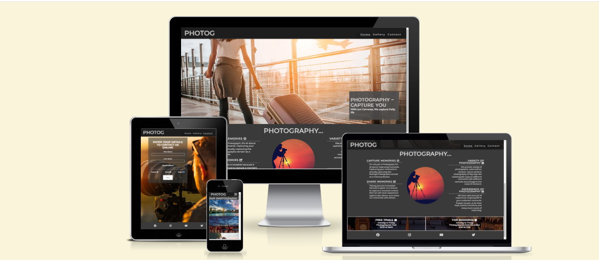
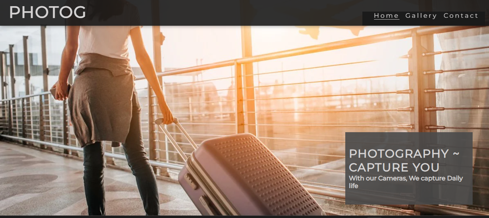
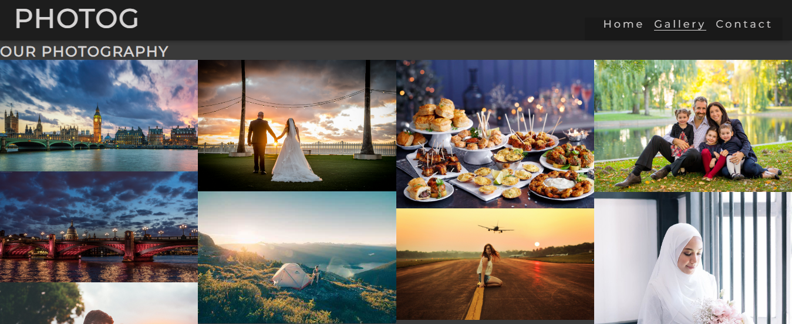
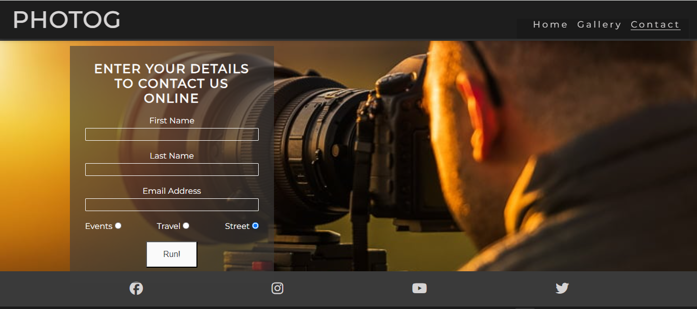
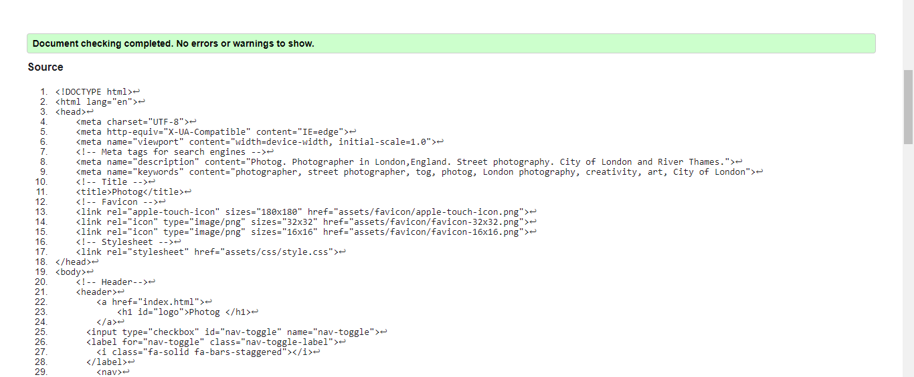
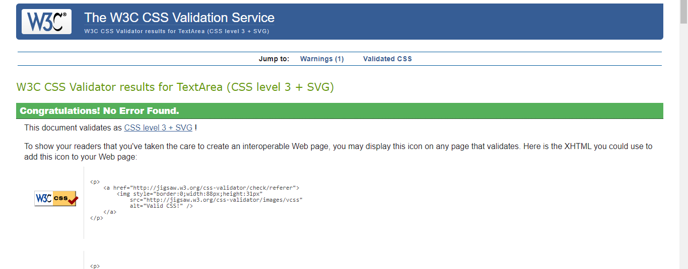
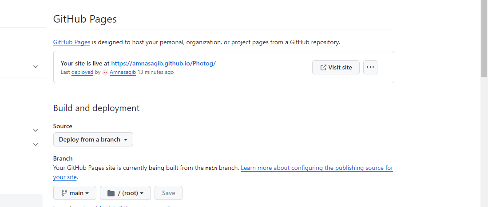

# Photog

* Photog is a website that targets the audience who are looking upto some good photographers.This site is 

designed simple and has all general information of the brand .

 * This site is live [here]( https://amnasaqib.github.io/Photog/).

## Contents

[User Experience](#user-experience)

[Photog](#photog)

-[Photog](photog)

- [Contents](#contents)
  - [User Experience](#user-experience)
    - [User Stories](#user-stories)
  - [Site Structure](#site-structure)
  - [Design Choices](#design-choices)
    - [Font](#font)
    - [Color Palette](#color-palette)
  - [Features](#features)
    - [Existing Features](#existing-features)
  - [Technologies used](#technologies-used)
  - [Testing](#testing)
  - [Additional testing](#additional-testing)
  - [Deployment and Development](#deployment-and-development)
    - [Deploying the Site](#deploying-the-site)
  - [Credits](#credits)
    - [Content](#content)
  - [Acknowledgements](#acknowledgements)
  ## User Experience

  ### User Stories
  As a user i want to:

   *look for a good photographic site
   *get some reasons to choose this photographer
   *get to know their abilities
   *look up on their past work 
   *be able to contact them online 

   ## Site Structure
   * This site is made of three pages , A home page showing some reasons to choose us. A gallery page with display of some of our work and a contact page. More information on the site features can be found in the [features](#features) section.

   
  ## Design Choices

  ### Font
* The fonts used throught the site are "Montserrat" and "sans-serif".

## Features

* Photog is designed to be an easy-to-use and interactive site with features that work on different devices.

#### Home

*The home page has heading  featured on the landing .
 * It is styled to be captivating and its contents refer to the purpose of the site.
  * This helps users to understand what the site is about and creates a positive first impression.
  

[Back to top](#contents)

## Descriptions Sections

* On the landing page is the description of photog.
* This contains reasons to choose us section .
* Defines the need of photography.

[Back to top](#contents)

#### Gallery 

* The gallery page contains a caption of Our Photography .
* It has several images .
* This page shows our past work.

[Back to top](#contents)

#### Contact

* This page has a form.
* Contact page gives an option to contact online by giving minimal personal details.
* It has an option of the type of photography to choose from.

#### Footer 
 
 *   The Footer contains various social media links ,

   
* [HTML5](https://html.spec.whatwg.org/)
  * Used to add structure and content to the site.

* [CSS](https://www.w3.org/Style/CSS/Overview.en.html)
  * Used to add style to the HTML.

* [CodeAnyWhere](https://app.codeanywhere.com/)
  * Used to create the code for repository.
 
* [Github](https://github.com/)
  * Used to store the repository and deploy the site.

[Back to top](#contents)

## Testing 

* This site is tested and Validated by:

* # W3C HTML Validator 
  
  
  
  * This site has 0 error.

* # CSS Validator
  
  
  
  ## Deployment and Development

### Deploying the Site

* The site was deployed using GitHub pages through the following steps:
1. In the "Photog" GitHub repository, click on "settings".
2. Scroll down and click on the "pages" tab.
3. In the dropdown menu for the branch, select "main".
4. Click on "save".
5. Refresh the page to view the deployed website link.

[Back to top](#contents)
